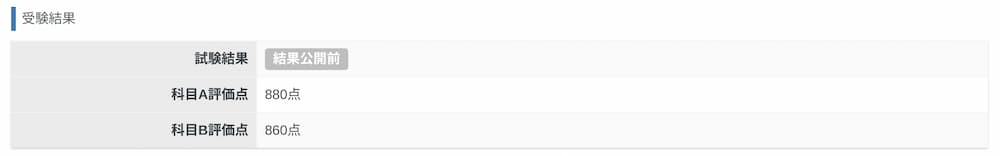

## はじめに

会社で取れと言われた基本情報技術者試験を受験してきました。
合格発表は１ヶ月先ですが、科目Aが880点、科目Bが860点とれたのでほぼ合格でしょう。
（正式に合否が発表されたら追記したいと思います。）

この記事では、基本情報技術者試験の振り返りを簡単に書いていこうと思います。

## 勉強法

科目Aの勉強には、以下の２つを利用しました。
- いちばんやさしい基本情報技術者絶対合格の教科書（翔泳社）
- [基本情報技術者試験ドットコム](https://www.fe-siken.com/)の過去問道場

勉強には以下のような流れで取り組みました。（括弧内は勉強にかかった大体の時間を書いてます。）
1. テキストの解説をサラッと１回読む（2週間）
2. テキストについている問題を2回解く（1週間）
3. 過去問道場の「試験回を指定して出題」にある「★おすすめ」（平成29年春期-令和5年免除）を１回解く（1週間）
4. 過去問道場の「模擬試験形式」を毎日１回以上解く（1週間）

これで大体１ヶ月＋１週間くらいですかね。
ただ、最後の4は覚えたことを忘れないようにしていただけなので、１ヶ月あれば合格自体は出来てたかなという印象です。

科目Bの勉強には、
- 公式のサンプル問題
- 情報処理教科書 出るとこだけ！基本情報技術者［科目B］（翔泳社）

を使いました。ただ、科目Bは最初にサンプル問題を解いた時点である程度解けていたので、あまり熱心に勉強しませんでした。テキストに関しても、最初の１周でほぼすべて解けてしまったので、あくまで出題形式に慣れるために使うという感じになりました。

## 受験当日

基本情報技術者試験はテストセンターでパソコンを操作して問題を解きます。受験時間は、科目Aが90分、科目Bが100分で間に10分間の休憩が取れます。ただ、実際のところは受験者が望めば科目や休憩を早く終わらせることが出来るので、必ずフルで時間を使わなければならないということはありません。

自分の場合、科目Aは50分、科目Bは70分くらいで問題を解ききってしまったので、全体を通して2時間くらいで終了しました。点数は試験を終了した時点で画面に表示されるので、（点数が合格ラインぎりぎりでなければ）精神衛生的に良いなと感じました。

ただ、受験していて以下の２点は少し気になりました。とはいえ、すぐに慣れたのでそこまで大きな影響はありませんでした。
- メモ用紙、キーボード、マウスで作業スペース埋まってしまったのが、自宅での環境と違った
- ボールペンのインクが、普段使っていたものと比べて出づらく感じた

## 感想

基本情報技術者試験は、名前の通り基本的な問題が出題されます。しかし、法律など自分の知識が薄い分野では、基本とはいえ初めて知る概念が多かったです。また、これまで何となく聞いたことがある程度のトピック同士が脳内で繋がることもあり、勉強していて楽しかったです。

今度は応用情報技術者試験にでも挑戦しようかなと思っています。
