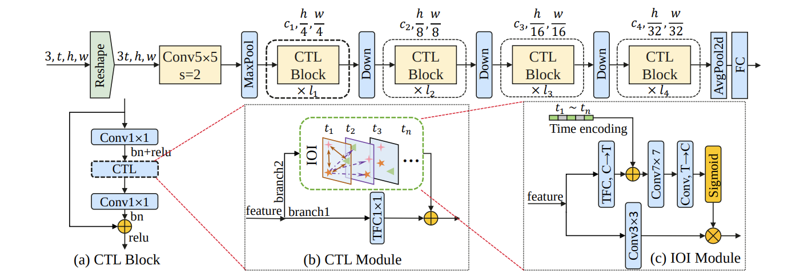

## 概要

- [No Time to Waste: Squeeze Time into Channel for Mobile Video Understanding](https://arxiv.org/abs/2405.08344)を読んだ
- SqueezeTimeをFlaxで実装した

## はじめに

[No Time to Waste: Squeeze Time into Channel for Mobile Video Understanding](https://arxiv.org/abs/2405.08344)で提案された、2DCNNベースの軽量な動画処理モデルであるSqueezeTimeを再実装しました。この記事では、SqueezeTimeと、再実装の簡単な使い方についてまとめます。

実装は[h-terao/squeeze-time-linen](https://github.com/h-terao/squeeze-time-linen)です。なお、現在手元にGPUがないため、実際のデータを用いた推論はおこなわず、乱数値を入力したときの出力結果を公式実装と比較することでしか検証していません。もし、バグなどがありましたらissueに投げてもらえると幸いです。

## SqueezeTime

SqueezeTimeは、2DCNNベースの軽量な動画処理モデルとして提案されました。
このモデルには以下の2つの特徴があります。
- 動画のフレーム列をチャネル方向に重ねたものを入力として受け取る
- 3DCNNやTransformerベースのモデルと近い精度を達成している

特に、1つ目の特徴が印象的です。このような入力を受け取るアプローチは、計算コストの面で見ると、3DCNNや各フレームを独立に処理する2DCNNと比べて有望です。
しかし、このアプローチは初期の動画処理モデルで採用されたものの、精度面の課題から徐々に使われなくなったという過去があります。
SqueezeTimeは、動画のフレーム列をチャネル方向に重ねたものを入力として受け取りつつ、
高い精度を達成するための１つの方向性を示したという点で面白いモデルだと考えています。

### 動画のフレーム列をチャネル方向に重ねたものを入力として扱う際の問題
動画のフレーム列をチャネル方向に重ねたものを入力として受け取る際、精度が劣化する原因は何でしょうか？

SqueezeTimeでは、時間情報がチャネル内でばらばらになってしまう点を挙げています。
2DCNNはたくさんのConvで入力を処理していきますが、そのチャネルは全結合と同じような方法でどんどん混ぜられていきます。これでは、フレームごとの重要度や順序といった時間的な情報が失われてしまい、動画を正しくモデリングできなくなってしまいます。

そこで、SqueezeTimeは時間的な情報を正しくモデリングするための、Channel-Time Learning (CTL) Moduleを導入しています。
CTL Moduleは、フレームごとの重要度や順序を学習によってうまくモデリングできるように設計されています。
SqueezeTimeの構造を図１に示します。この図を見ると分かるように、CTL Moduleは、畳み込み層と置き換える形で用います。


### Channel-Time Learning Module
CTL Moduleは、フレームごとの重要度や順序をモデリングできるように設計されています。
具体的には、フレームごとの重要性をモデリングするためのTemporal Focus Convolution (TFC)と、
フレームの順序をモデリングするInter-temporal Object Interaction (IOI) Moduleによって構成されています。

#### Temporal Focus Convolution

TFCは、各チャネルを動的に重み付けしてから畳み込みをおこなうConvです。
重み付けによって、重要なフレームの情報を含むチャネルに重点をおき、逆に重要なフレームの情報を含まないチャネルはほとんど考慮しない、といった動画の処理が可能になります。

TFCの実装は比較的簡単です。以下のように、ParamConvでチャネルごとの重みを計算したあと、入力にその重みを掛けてConvに渡せばOKです。
```python
class ParamConv(linen.Module):
    """A module that calculates the temporal-adaptive weights."""

    conv: ModuleDef = linen.Conv
    norm: ModuleDef = linen.BatchNorm

    @linen.compact
    def __call__(self, x: chex.Array) -> chex.Array:
        in_features = jnp.size(x, axis=-1)
        param = einops.reduce(x, "... h w c -> ... 1 1 c", "mean")
        param = self.conv(in_features, kernel_size=(1, 1), use_bias=False, name="conv1")(param)
        param = self.norm(name="norm1")(param)
        param = linen.relu(param)
        param = self.conv(in_features, kernel_size=(1, 1), use_bias=False, name="conv2")(param)
        param = linen.sigmoid(param)
        return param


class TFC(linen.Module):
	...

    @linen.compact
    def __call__(self, x: chex.Array) -> chex.Array:
        # Calculate temporal-adaptive weights
        param = ParamConv(conv=self.conv, norm=self.norm, name="param_conv")(x)

        # Temporal focus convolution
        x = self.conv(
            self.features,
            kernel_size=to_2tuple(self.kernel_size),
            padding=to_padding(self.padding),
            feature_group_count=self.feature_group_count,
            use_bias=self.use_bias,
            name="temporal_conv",
        )(x * param)

		return x
```
ただし、チャネルごとの重みはCTL Module内で使いまわすような構造になっているため、実際の実装は少し上とは異なっています。

#### Inter-temporal Object Interaction Module

IOI Moduleは、Temporal Positional Encodingを用いてフレームの順序をモデリングします。Temporal Positional Encodingは、Transformer系のモデルで用いられるPositional Encodingと同じようなものになっています。

具体的な処理としては、以下のようになります。
1. TFCを使って、チャネル数をフレーム数 T まで落とす
2. Temporal Positional Encodingをかける
3. 7x7 Convをかける
4. 3x3 Conv + Sigmoidでチャネル数をもとに戻す。
これらの処理で得られたテンソルを、もとの入力に対して3x3 Convをかけたテンソルにかけることで最終的な出力を得ます。

ただし、Temporal Positional Encodingは以下のように実装できます。
ここで resize を使っているのは、パッチごとにPositional EncodingをかけるTransformer系のモデルを参考にしているからだと思います。
```python
*_, h, w, _ = jnp.shape(x)
x += resize(
	self.param("pos_embed", linen.initializers.kaiming_normal(), (self.pos_dim, self.pos_dim, self.num_frames)),
	shape=(h, w, self.num_frames),
	method="bilinear",
	antialias=False,
)
```
Temporal Positional Encodingを適用することで、フレームの順序情報を中間値に加えることができ、フレームの順序をモデリングするように学習することができます。

## 再現実装

SqueezeTimeは、[PyTorch版の公式実装](https://github.com/xinghaochen/SqueezeTime)と[MindSpore版の公式実装](https://github.com/mindspore-lab/models/tree/master/research/huawei-noah/SqueezeTime)が公開されています。
今回は、PyTorch版の公式実装を参考にして、FlaxでSqueezeTimeを再実装をしてみました。

推論を行なう前に、まず以下のことをおこなってください。
- `squeeze_time_linen.py`をコピーする
- （Optional）事前学習済みの重みを[ここ](https://drive.google.com/drive/folders/17KX5RKGecMEWf5_NrA0VlhrR5_d7JH2x?usp=sharing)からダウンロードする

あとは、以下のようにして推論をおこなうことができます。
```python
import pickle

import jax.numpy as jnp
import jax.random as jr
from squeeze_time_linen import resnet50

# 事前学習済みの重みを使わないなら、None
pretrained_path = "k400.pkl"

# モデルを作る
# num_classesは事前学習に使用したデータセットに合わせること
flax_model = resnet50(num_classes=400)

if pretrained_path:
    with open(pretrained_path, "rb") as fp:
        variables = pickle.load(fp)
else:
    dummy_inputs = jnp.zeros((16, 224, 224, 3))
    variables = flax_model.init(jr.PRNGKey(0), dummy_inputs)

# 動画Array
# 値の範囲: [0, 255]
# 形: (*batch_dims, time, height, width, channels)
# ただし、batch_dimsは任意の次元
# 注意：事前学習済みの重みを使う場合、timeは16で固定
x = jnp.zeros((16, 224, 224, 3))

# Normalize
mean = jnp.array([123.675, 116.28, 103.53])
std = jnp.array([58.395, 57.12, 57.375])
x = (x - mean) / std

# 推論
logits = flax_model.apply(variables, x, is_training=False)
```

例を見ると分かるように、なるべくFlaxで標準的な実装で推論できるようにしています。
学習コードはまだ実装していませんが、Flaxに慣れている人なら自力で実装するのもそこまで難しくないと思います。

### メモ：align_corners付きのリサイズ

Temporal Positional Encodingを適用する際、pos_embedをリサイズする必要があります。公式実装では、このリサイズにPyTorchのinterpolate関数を使っています。

ここで、問題になるのはinterpolate関数のalign_cornersオプションです。
JAXにはjax.image.resize関数がありますが、このalign_cornersオプションが存在しません。しかも、厄介なことに、align_cornersのON/OFFによって、出力結果がかなりずれてきてしまうことも、公式実装を使った実験で分かりました。

さてどうしたものかと調べていたら、[こちらに](https://github.com/google/jax/issues/11206#issuecomment-1423140760)に、以下のようなalign_corners付きのリサイズ関数が載っていました。この関数を使うことで、PyTorchによる公式実装に近い出力値を得られるようになりました。

```python
def resize_with_aligned_corners(
    image: chex.Array,
    shape: Sequence[int],
    method: str | jax.image.ResizeMethod,
    antialias: bool,
):
    """Alternative to jax.image.resize(), which emulates align_corners=True in PyTorch's
    interpolation functions.

    Copy from https://github.com/google/jax/issues/11206#issuecomment-1423140760
    """
    spatial_dims = tuple(i for i in range(len(shape)) if not jax.core.symbolic_equal_dim(image.shape[i], shape[i]))
    scale = jnp.array([(shape[i] - 1.0) / (image.shape[i] - 1.0) for i in spatial_dims])
    translation = -(scale / 2.0 - 0.5)
    return jax.image.scale_and_translate(
        image,
        shape,
        method=method,
        scale=scale,
        spatial_dims=spatial_dims,
        translation=translation,
        antialias=antialias,
    )
```